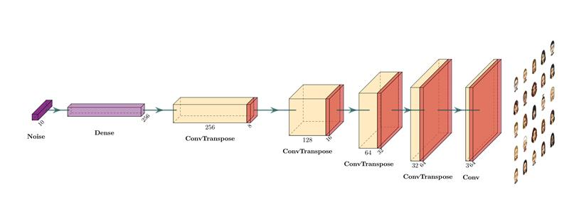

WGAN-GP
===

The project is to create bitmojis based on a GAN implementation.

Architecture
---

We based our GAN on a Wasserstein Generative Adversial Network with gradient penalty to avoid as much as possible mode collapse and get the more diversity.

### Generator

### Discriminator

Preview of the results
---

